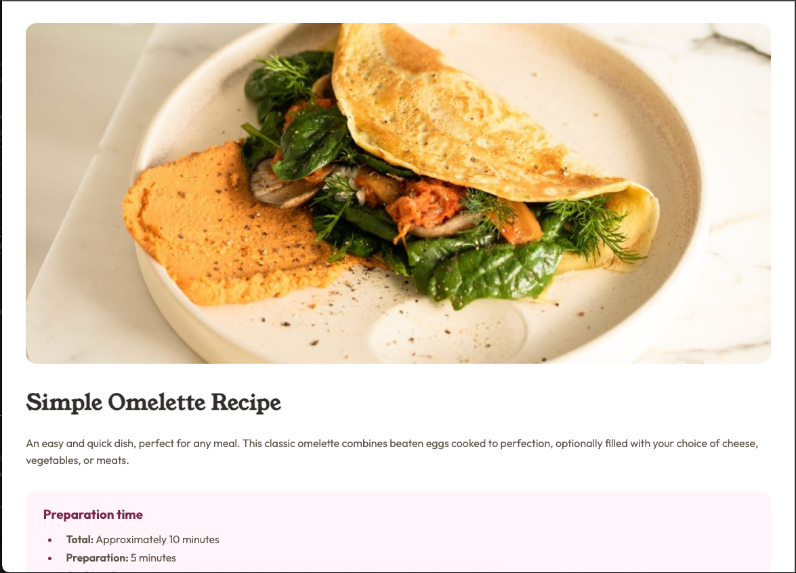
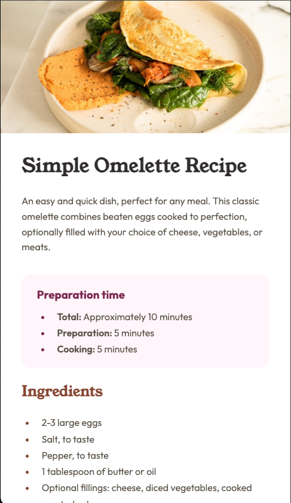

# Frontend Mentor - Recipe page solution

This is a solution to the [Recipe page challenge on Frontend Mentor](https://www.frontendmentor.io/challenges/recipe-page-KiTsR8QQKm).

## Table of contents

- [Overview](#overview)
  - [The challenge](#the-challenge)
  - [Screenshot](#screenshot)
  - [Links](#links)
- [My process](#my-process)
  - [Built with](#built-with)
  - [What I learned](#what-i-learned)
  - [Continued development](#continued-development)
  - [Useful resources](#useful-resources)
- [Author](#author)
- [Acknowledgments](#acknowledgments)
- [Style Guide](#style-guide)
  - [Colors](#colors)
  - [Typography](#typography)

## Overview

### The challenge

The challenge was to build a visually appealing and responsive recipe page based on the provided design. This involved structuring the content logically with HTML and styling it effectively with CSS to match the desktop and mobile layouts.

### Screenshot




### Links

- Solution URL: [https://github.com/CodeKellyCat/recipe-page-main](https://github.com/CodeKellyCat/recipe-page-main)
- Live Site URL: [https://codekellycat.github.io/recipe-page-main/](https://codekellycat.github.io/recipe-page-main/)

## My process

### Built with

- Semantic HTML5 markup
- CSS custom properties

### What I learned

This project provided valuable practice in creating responsive layouts using standard CSS. A key learning was understanding how to effectively reformat images for different screen sizes using CSS media queries. I utilized media queries to adjust the image's display and sizing for the desktop view.

```css
/* Desktop specific image styles */
@media (min-width: 992px) {
  img {
    display: block;
    width: auto;
    max-width: 94%;
    height: auto;
    margin: 2rem auto;
    border-radius: 1rem;
  }
}
```

### Spacing and Layout Insights

Through this project, I gained a deeper understanding of when to use **padding** versus **margin** to achieve optimal spacing between elements. By analyzing the layout and experimenting with both properties, I was able to create a more intentional visual rhythm and structure for the recipe page.

## Continued Development

Looking ahead, I aim to:

- Refine my understanding of **responsive design principles**.
- Explore more advanced **CSS layout techniques**.
- Improve my ability to **strategically apply padding and margin** for better spacing and layout control.
- Optimize CSS for **maintainability and scalability**, ensuring closer adherence to provided style guides.

## Useful Resources

- [W3Schools](https://www.w3schools.com/) - Provided a strong foundation for understanding HTML and CSS syntax and properties.

## Author

**Kelly McLaughlin**

- [Website](#)
- [Frontend Mentor Profile](https://www.frontendmentor.io/profile/CodeKellyCat)
- [GitHub](https://github.com/CodeKellyCat)

## Acknowledgments

A big thank you to the **Frontend Mentor** community for providing this engaging challenge! This project was a great opportunity to practice and improve my frontend development skills.
